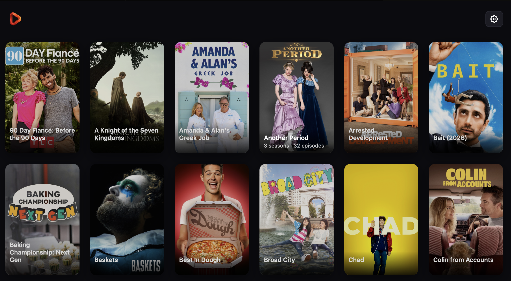
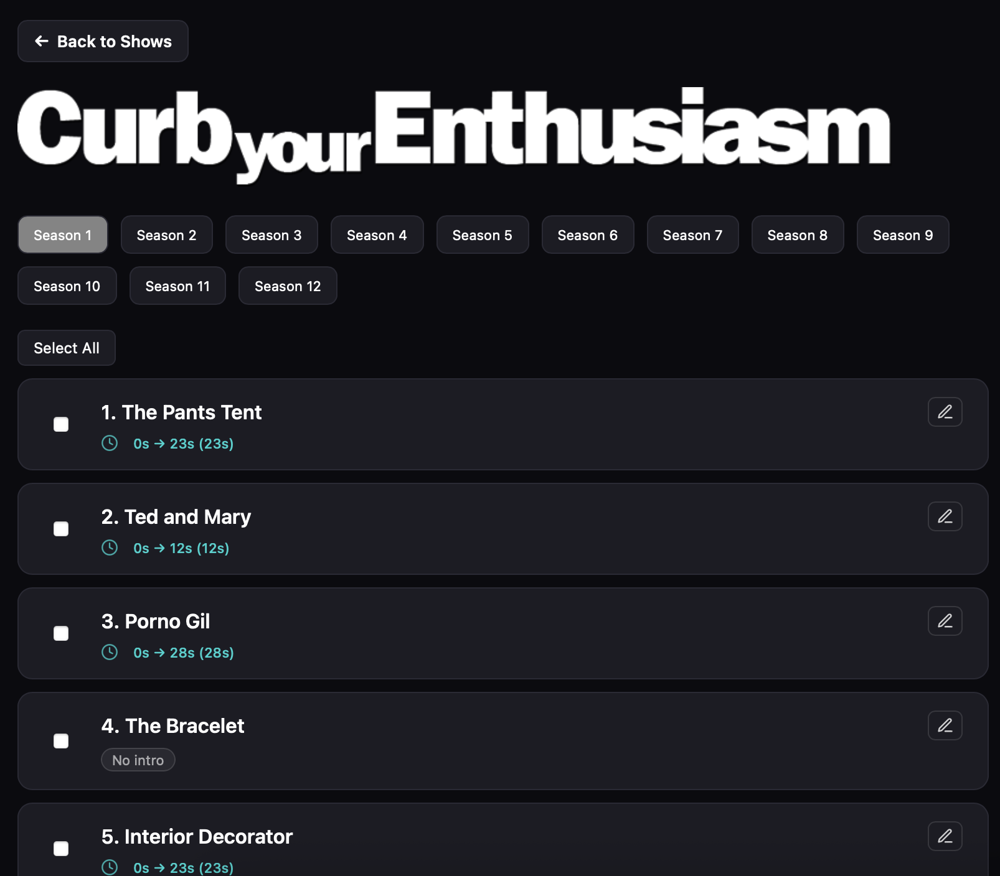
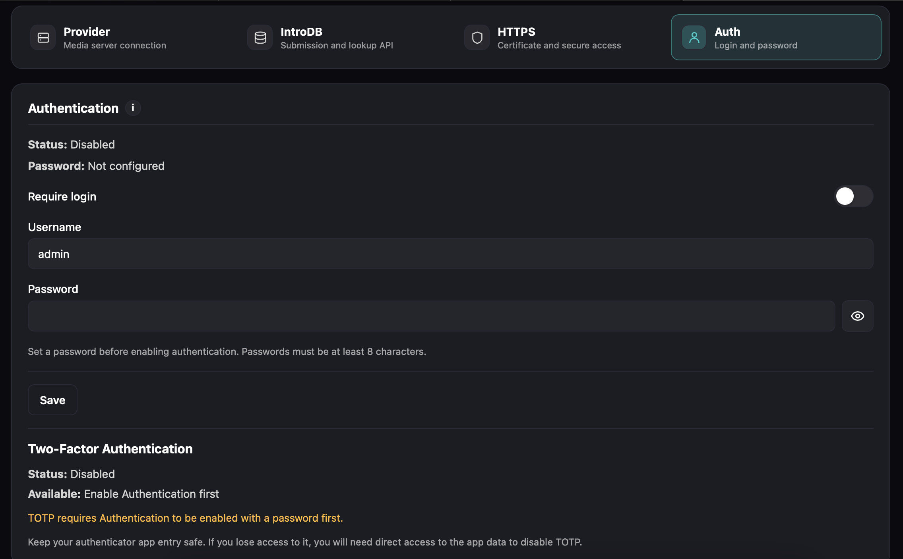
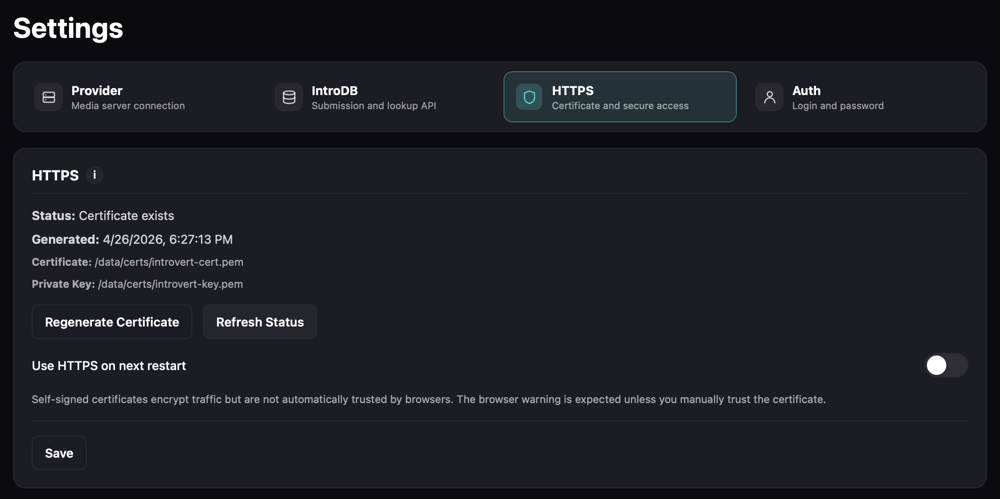
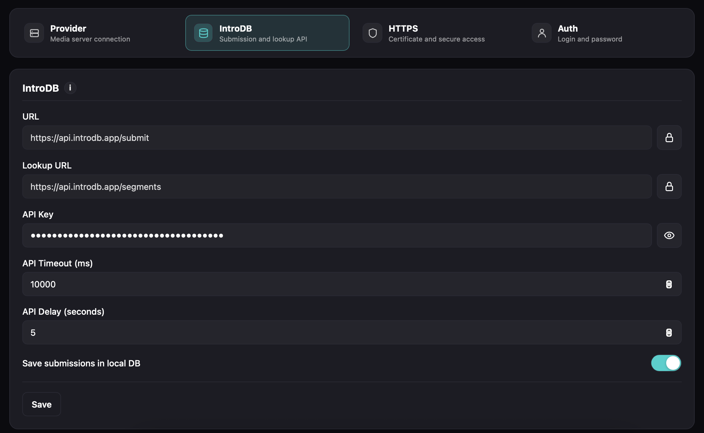
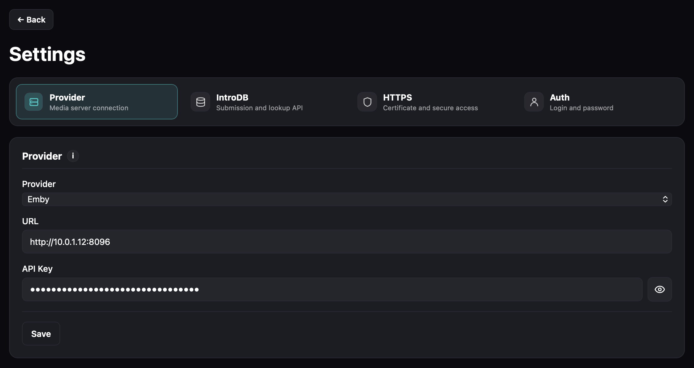
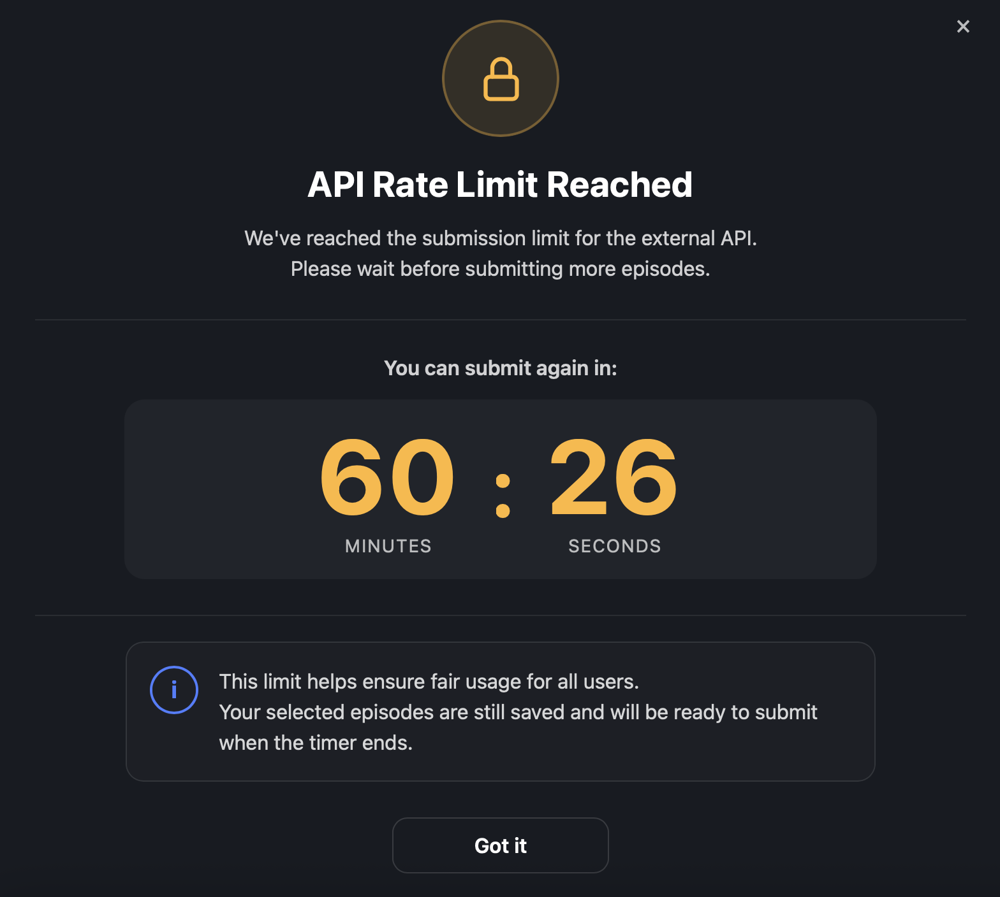

# introvert

Introvert is a self-hosted web app for managing and submitting TV show intro timestamps.  
It integrates with media servers like Emby, Jellyfin and Plex, and submits intro data to [IntroDB](https://introdb.app).

## Screenshots

<table>
  <tr>
    <td align="center">
      <a href="docs/images/screen_app.png">
        
      </a>
      <br>
      App
    </td>
    <td align="center">
      <a href="docs/images/screen_show_details.png">
        
      </a>
      <br>
      Show Details
    </td>
    <td align="center">
      <a href="docs/images/screen_admin_auth.png">
        
      </a>
      <br>
      Admin Auth
    </td>
    <td align="center">
      <a href="docs/images/screen_admin_http.png">
        
      </a>
      <br>
      Admin HTTP
    </td>
     </tr>
  <tr>
    <td align="center">
      <a href="docs/images/screen_admin_introdb.png">
        
      </a>
      <br>
      Admin IntroDB
    </td>
    <td align="center">
      <a href="docs/images/screen_admin_provider.png">
        
      </a>
      <br>
      Admin Provider
    </td>
       <td align="center">
      <a href="docs/images/screen_api_limit.png">
        
      </a>
      <br>
      API Limit
    </td>
  </tr>
</table>

## Current media server support
- [Emby](https://emby.media)
  * Full metadata, image (poster and logo) and intro timestamp support
- [Jellyfin](https://jellyfin.org)
  * Metadata and image (poster and logo) support only. Jellyfin doesn't have native support for intro timestamps. Timestamps can be manually entered or you can try using intro detection in the app (beta).
- [Plex](https://www.plex.tv)
  * Metadata and image (poster and logo) support only. Timestamps can be manually entered or you can try using intro detection in the app (beta).
- Local storage
  * Metadata and image (poster) support only. Timestamps can be manually entered or you can try using intro detection in the app (beta).
 
## Features

- Browse shows from your media server or directly from storage location
- View seasons and episodes
- Edit intro timestamps per episode
- Submit intros to [IntroDB](https://introdb.app)
- Avoid duplicate submissions via lookup checks
- Optional local database tracking of submitted episodes
- Visual indicator for already submitted episodes
- Scan for missing episode intros (beta)
- Multi-provider support (Emby + Jellyfin + Plex + Local)
- Launch show or episode directly from the app in your current provider (Emby, Jellyfin or Plex)
- Optional HTTP and HTTPS support with cert generation
- Optional authentication with TOTP
- Docker-ready for easy deployment

## Getting Started (Docker)
```
services:
  introvert:
    container_name: introvert
    image: ghcr.io/introvertapp/introvert:latest
    restart: unless-stopped
    user: 1000:1000   # change to match your user
    ports:
      - "3001:3001"
    environment:
      PORT: 3001
      SETTINGS_DB_PATH: /data/app.db
    volumes:
      - YOUR_HOST_PATH:/data
      - YOUR_MEDIA_PATH:/data/tvshows:ro   # has to match media center exactly
```

## Launch container
```
docker compose up -d
```

## Launch the app
```
http://YOUR_IP:3001
```

## Initial Setup

On first launch:

1. You will be redirected to the **Admin Panel**
2. Configure (all fields are required):

### Provider
- Select provider (Emby / Jellyfin / Plex)
- Enter:
  - Base URL (e.g. `http://10.0.1.12:8096`)
  - API Key

### IntroDB
- Submit URL (default prefilled)
- Lookup URL (default prefilled)
- API Key

### API Timeout
- How long will the app wait for IntroDB response (ex. 10000)

### API Delay
- Delay between each submission to IntroDB. Keep this at a reasonably
  high number so you don't spam the API

### Optional
- Enable **Save submissions in local DB**

---

## Local Submission Tracking

When enabled:

- Successful submissions are stored in SQLite
- Episodes display:
  - Pulsating dot next to title = already submitted

Stored data includes:
- provider ID + episode ID
- IMDb ID
- season/episode numbers
- intro start/end timestamps
- submission result + timestamp

---

## Submission Flow

For each episode:

1. Lookup IntroDB  
2. Compare:
   - Missing → submit
   - Different → submit
   - Duplicate → skip  
3. Handle rate limits gracefully  
4. Optionally store locally

---

## License

This project is licensed under the Creative Commons Attribution-NonCommercial 4.0 International License.

You are free to use, modify, and distribute this software for non-commercial purposes only.

Commercial use is prohibited without explicit permission.
