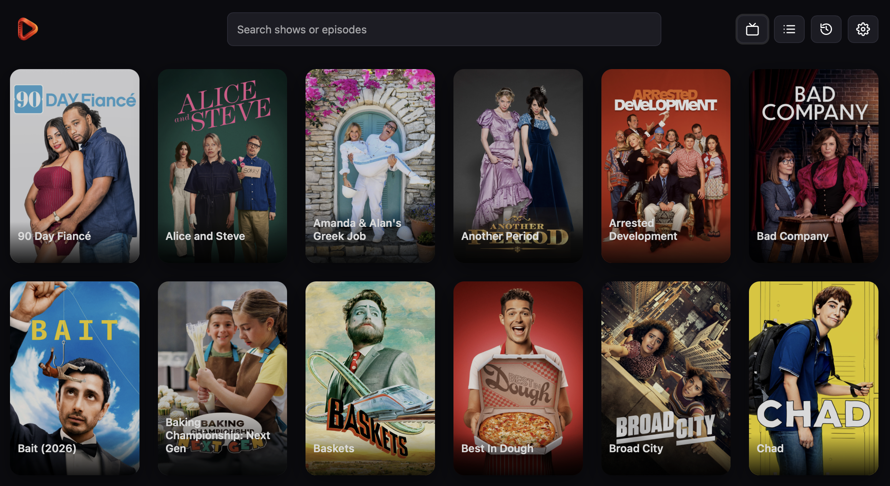
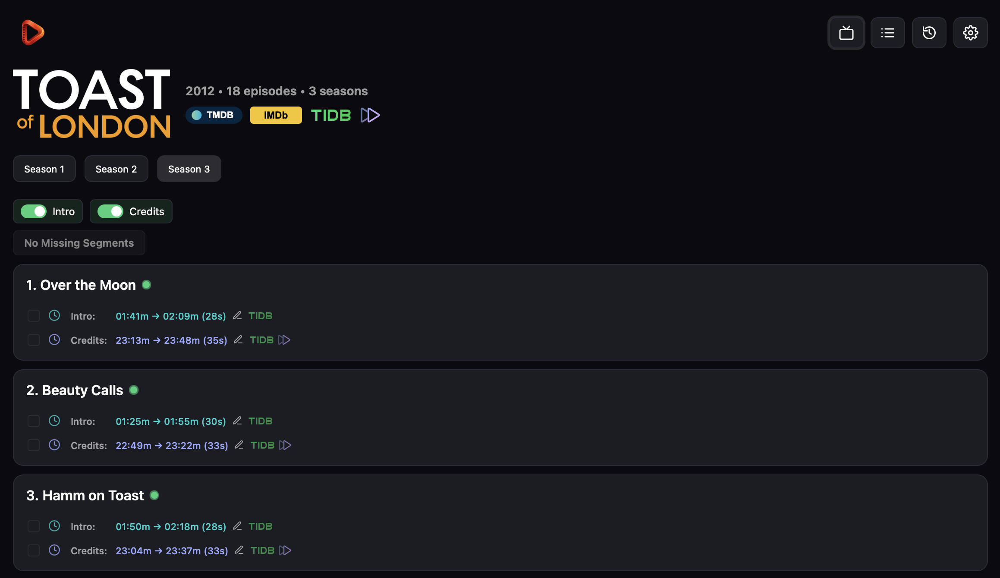
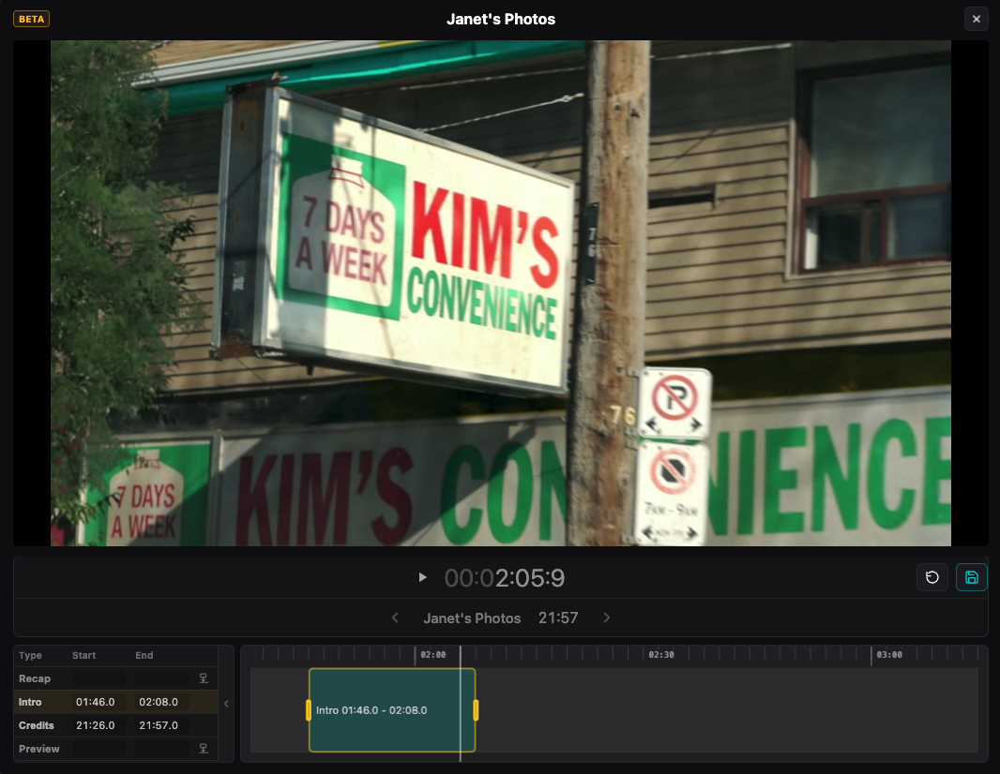
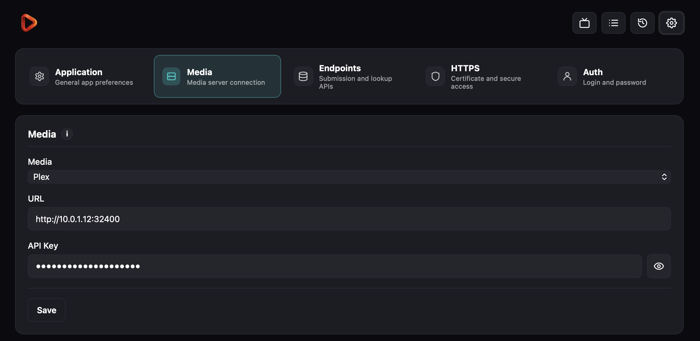
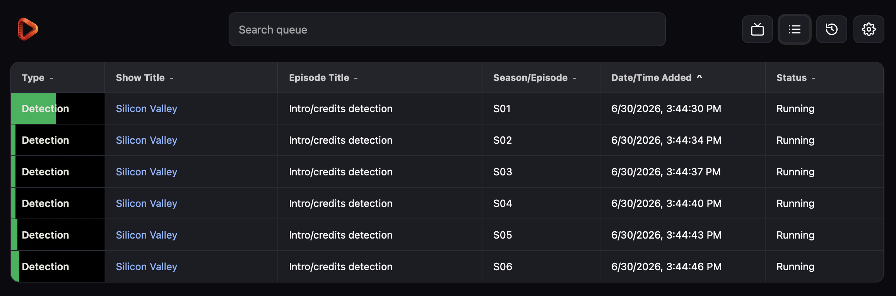
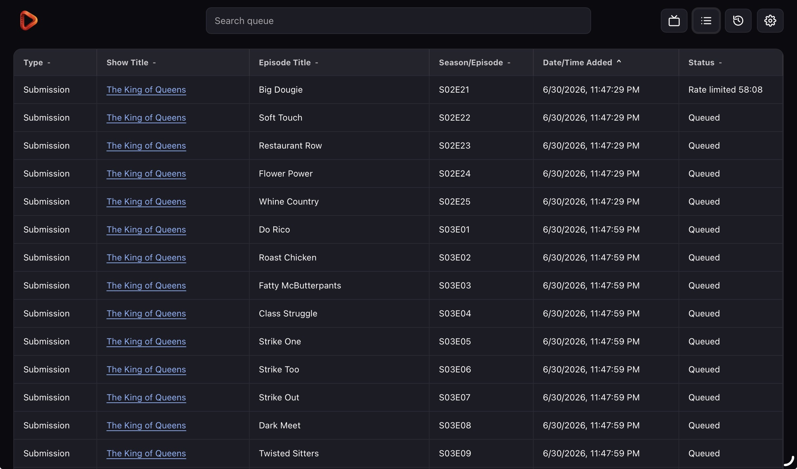
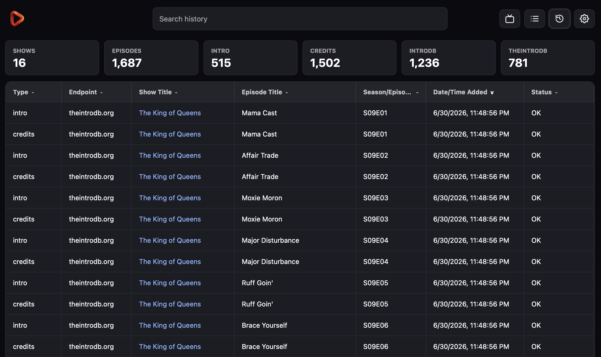

# introvert

Introvert is a self-hosted web app for managing and submitting TV show segments timestamps. It integrates with media servers like Emby, Jellyfin and Plex, and submits segments timestamps to [IntroDB](https://introdb.app) and [TheIntroDB](https://theintrodb.org).

## Screenshots

<table>
  <tr>
    <td align="center">
      <a href="assets/images/app.png">
        
      </a>
      <br>
      App
    </td>
    <td align="center">
      <a href="assets/images/show.png">
        
      </a>
      <br>
      Show Details
    </td>
    <td align="center">
      <a href="assets/images/segment_video_editor.png">
        
      </a>
      <br>
      Segment Video Editor
    </td>
    <td align="center">
      <a href="assets/images/admin.png">
        
      </a>
      <br>
      Admin
    </td>
     </tr>
  <tr>
    <td align="center">
      <a href="assets/images/detection_queue.png">
        
      </a>
      <br>
      Detection Queue
    </td>
    <td align="center">
      <a href="assets/images/submission_queue.jpeg">
        
      </a>
      <br>
      Submission Queue
    </td>
    <td align="center">
      <a href="assets/images/history.png">
        
      </a>
      <br>
      History
    </td>
  </tr>
</table>

## Current media server support
- [Emby](https://emby.media)
  * Full metadata, image (poster and logo) and intro segment timestamp support
- [Jellyfin](https://jellyfin.org)
  * Metadata and image (poster and logo) support only. Jellyfin doesn't have native support for segments timestamps. Timestamps can be manually entered, using segments timestamps detection and/or via Segment Video Editor.
- [Plex](https://www.plex.tv)
  * Metadata and image (poster and logo) support only. Timestamps can be manually entered, using segments timestamps detection and/or via Segment Video Editor.
- Local storage
  * Metadata and image (poster) support only. Timestamps can be manually entered, using segments timestamps detection and/or via Segment Video Editor.
 
## Features

- Browse shows from your media server or directly from storage location
- View seasons and episodes
- Search for TV shows and episodes in your library (ex. "Seinfeld", "Seinfeld The Wallet", "Seinfeld S04E05")
- Edit segments timestamps per episode
- Edit and/or add segments via Segments Video Editor
    - (BETA - Works best with Chrome. Safari is sluggish. MKV format is usable but difficult to handle)
- Submit segments timestamps to [IntroDB](https://introdb.app) and [TheIntroDB](https://theintrodb.org)
- Avoid duplicate submissions via lookup checks
- Optional local database tracking of submitted episodes
- Visual indicator for already submitted episodes
- Scan for missing episode segments
- Multi-provider support (Emby + Jellyfin + Plex + Local)
- Segment timestamp import from Emby, Jellyfin, Plex
- Launch show or episode directly from the app in your current provider (Emby, Jellyfin or Plex)
- Optional HTTP and HTTPS support with cert generation
- Optional authentication with TOTP
- Docker-ready for easy deployment

## Keyboard Shortcuts (Segments Video Editor)

### Playback

- `Space` / `K` — Play or pause video preview
- `Left` / `Right` — Move playhead by one frame
- `Shift` + `Left` / `Right` — Move playhead by one second
- `Home` / `End` — Move playhead to start or end
- `Shift` + `Z` — Reset timeline zoom to full view

### Segments

- `R` — Insert recap at playhead
- `I` — Insert intro at playhead
- `C` — Insert credits at playhead
- `P` — Insert preview at playhead
- `Delete` / `Backspace` — Delete selected segment drafts
- `Cmd/Ctrl` + `A` — Select all segment drafts
- `Cmd/Ctrl` + `Z` — Undo last timeline edit

### Editor

- `S` — Open or close segment drawer
- `H` — Open or close this shortcut map
- `J` / `L` — Go to previous or next episode
- `Cmd/Ctrl` + `S` — Save timeline changes
- `Cmd/Ctrl` + `R` — Reset timeline changes
- `Esc` — Close shortcut map, then close video editor

## Getting Started (Docker)
```
services:
  introvert:
    container_name: introvert
    image: ghcr.io/introvertapp/introvert:latest
    restart: unless-stopped
    user: 1000:1000   # change to match your user
    ports:
      - "3001:3001"
    environment:
      PORT: 3001
      SETTINGS_DB_PATH: /data/app.db
    volumes:
      - YOUR_HOST_PATH:/data
      - YOUR_MEDIA_PATH:/data/tvshows:ro   # has to match media center exactly
```

## Launch container
```
docker compose up -d
```

## Launch the app
```
http://YOUR_IP:3001
```

## Initial Setup

On first launch:

1. You will be redirected to the **Admin Panel**
2. Configure (all fields are required):

### Provider
- Select provider (Emby / Jellyfin / Plex)
- Enter:
  - Base URL (e.g. `http://10.0.1.12:8096`)
  - API Key

### IntroDB
- Submit URL (default prefilled)
- Lookup URL (default prefilled)
- API Key

### API Timeout
- How long will the app wait for IntroDB response (ex. 10000)

### API Delay
- Delay between each submission to IntroDB. Keep this at a reasonably
  high number so you don't spam the API

### Optional
- Enable **Save submissions in local DB**

---

## Local Submission Tracking

When enabled:

- Successful submissions are stored in SQLite
- Episodes display:
  - Pulsating dot next to title = already submitted

Stored data includes:
- provider ID + episode ID
- IMDb ID
- season/episode numbers
- intro start/end timestamps
- submission result + timestamp

---

## Submission Flow

For each episode:

1. Lookup IntroDB  
2. Compare:
   - Missing → submit
   - Different → submit
   - Duplicate → skip  
3. Handle rate limits gracefully  
4. Optionally store locally

---

## License

This project is licensed under the Creative Commons Attribution-NonCommercial 4.0 International License.

You are free to use, modify, and distribute this software for non-commercial purposes only.

Commercial use is prohibited without explicit permission.
